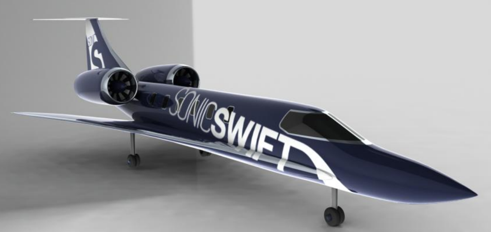
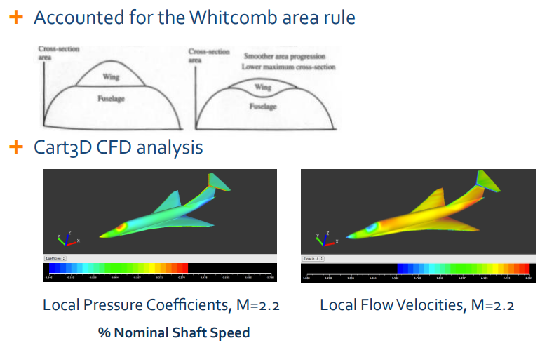
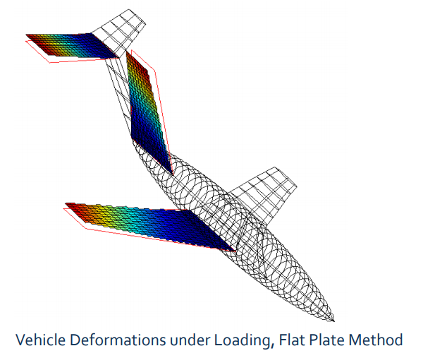
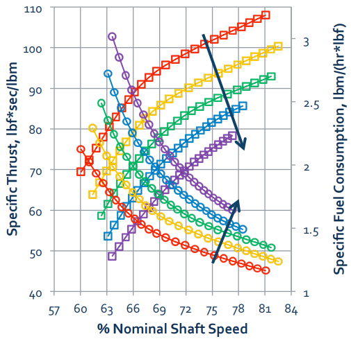
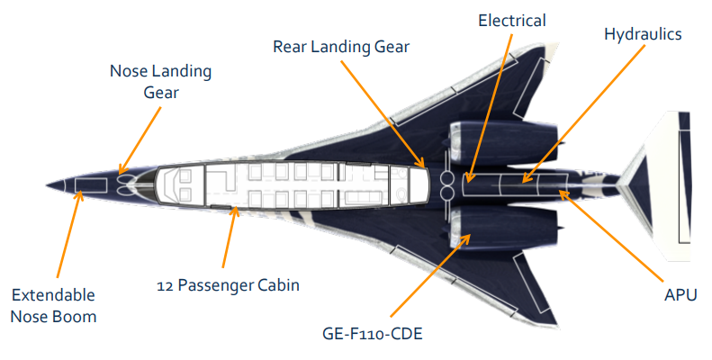

# __Supersonic Business Jet__ - _Virginia Tech Aerospace Engineering Senior Design Project 2012_

## Description

This project provides detailed explanations and results relating to the preliminary vehicle sizing and subsequent initial design iteration of a supersonic business jet concept vehicle.

## Design Process Overview

Due to the current lack of supersonic transportation options for corporate, political and military leaders, there is a demand for a vehicle that can provide extremely fast transportation, even enabling single day, round-trip trans-Atlantic travel. With a design cruise speed of Mach 2.2, and a range of nearly 5,000nm, this vehicle is designed to carry a maximum of 12 passengers. 

This report outlines the evolution of aerodynamic design to a highly swept delta wing, optimized in a NASA supersonic aerodynamics study. Drag was 
calculated using the component build-up method, FRICTION code, and Cart3D CFD analysis.

The wings and empennage were analyzed using beam bending and flat plate stress based analysis, and was optimized using an in-house optimizer. The final propulsion unit is a civil derivative engine of the GE F118. Detailed performance calculations and analysis were performed to determine realistic vehicle performance, complying with FAA and ICAO regulations.

Landing gear was sized, and placed in the vehicle to retract into the fuselage without landing gear pods. Interior, cabin and cockpit systems were sized semi-empirically, as well as hydraulic, electrical and auxiliary power systems. Emergency systems were integrated according to FAA regulations. For sonic boom mitigation, an extendable nose boom, shaped nose and careful adherence to the supersonic area rule allows for significantly decreased sonic boom noise when compared to the Concorde.

Finally, this report describes the final design iteration, and outlines the vehicles performance, characteristic parameters and estimated sonic boom strength. This concept vehicle shows that it is technologically and economically feasible to break the sound barrier for business 
jets.
